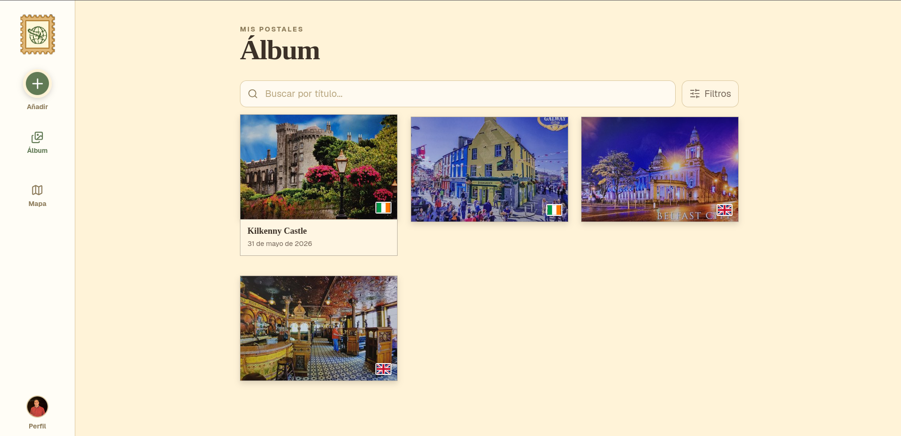
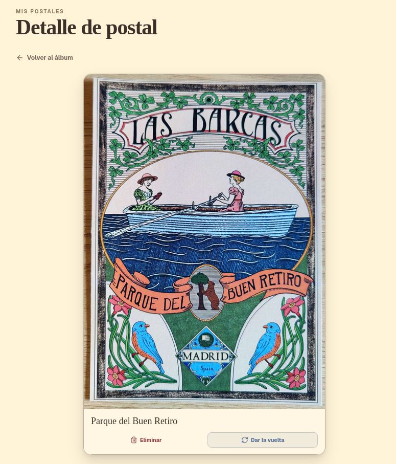
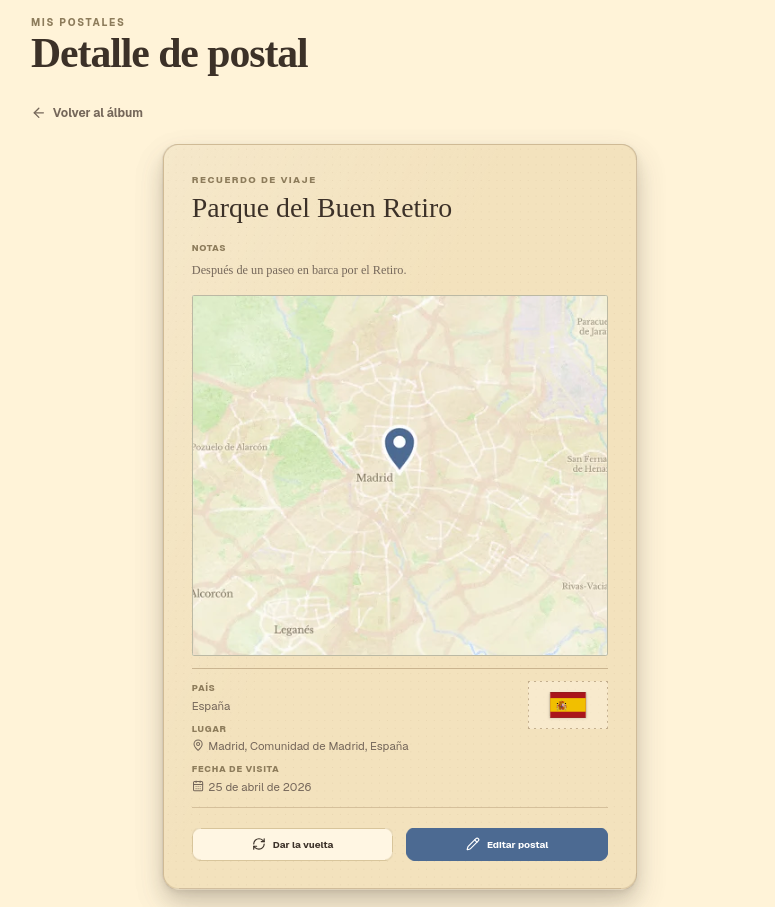
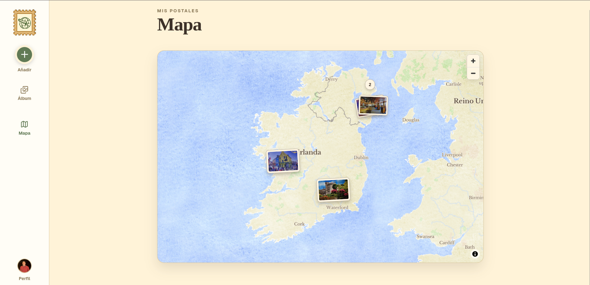
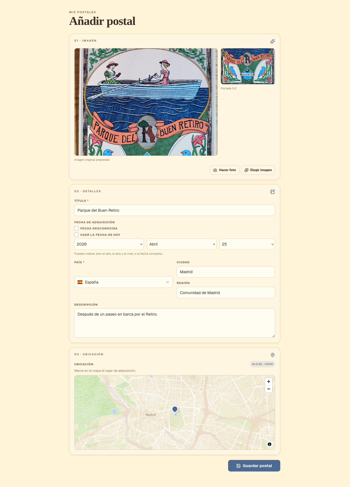

# MyMemories: A visual home to store, revisit and manage all your postcards and souvenirs.

  

## Why MyMemories?

As a postcard collector, I have faced the same problem since I started collecting: all my postcards are, if I'm lucky, kept together in a single box, where they remain until I want to look through or organize them.

This makes simple tasks surprisingly difficult, such as finding a specific postcard, knowing how many postcards I own, or checking whether I already have one from a particular place.

MyMemories is a personal project created to solve these problems. Whenever a new postcard arrives, the application lets you add it to your collection along with useful information such as its location, coordinates, date, and an optional description.

Once your collection is digitalized, browsing and filtering your postcards becomes as easy as flipping through a photo album — or even easier!

## Features

| | What you can do |
|---|---|
| **Build your collection** | Add postcards from a camera or gallery and provide a title, country, city, region, description, and location. |
| **Make every image feel right** | Crop and rotate the original image, then prepare a dedicated 3:2 cover for the album. |
| **Browse like an album** | View postcards in a visual grid, search by title, and filter by place or date. |
| **See the journey** | Explore postcard markers on a world map, with clusters for places where memories meet. |
| **Open the full story** | View a postcard's information, edit it, replace its images, or delete it. |
| **Make it yours** | Create a personal account, see your stats and custom your profile. |

## Screenshots

### Collection

  

### Postcard details

  
  &nbsp;&nbsp;&nbsp;&nbsp;&nbsp;&nbsp;&nbsp;&nbsp;
  

### Postcards map

  

### Adding a new postcard

  

<!-- TODO: Add polished screenshots for the add-postcard flow, postcard detail view, and world map when available. -->

## Tech Stack

### Frontend

- React with TypeScript
- Vite
- Tailwind CSS
- React Router and TanStack Query
- MapLibre GL with Supercluster
- React Advanced Cropper

### Backend

- Python 3.14 with FastAPI and Uvicorn
- SQLAlchemy and GeoAlchemy2
- Pillow for image processing
- JWT authentication with `pwdlib`/Argon2 password hashing

### Database & Infrastructure

- PostgreSQL 17 with PostGIS
- Node.js map-rendering service using Playwright, MapLibre GL, and Sharp
- Docker Compose
- Nginx for serving the production frontend build

## Development

See [`DEVELOPMENT.md`](DEVELOPMENT.md) for prerequisites, local setup with Docker Compose, frontend and backend workflows, testing, and deployment notes.

## Disclaimer

MyMemories is a personal project designed with a private, non-public deployment in mind. It has not undergone a professional security audit and should not be considered hardened for exposure to the public internet.

Security was considered throughout development, and reasonable measures were taken for the project's intended personal use. Nevertheless, vulnerabilities or security breaches may still exist. Anyone adapting MyMemories for an internet-facing deployment should perform an appropriate security review and add any hardening required for that environment.

If you discover a security issue, please report it privately rather than opening a public issue.
